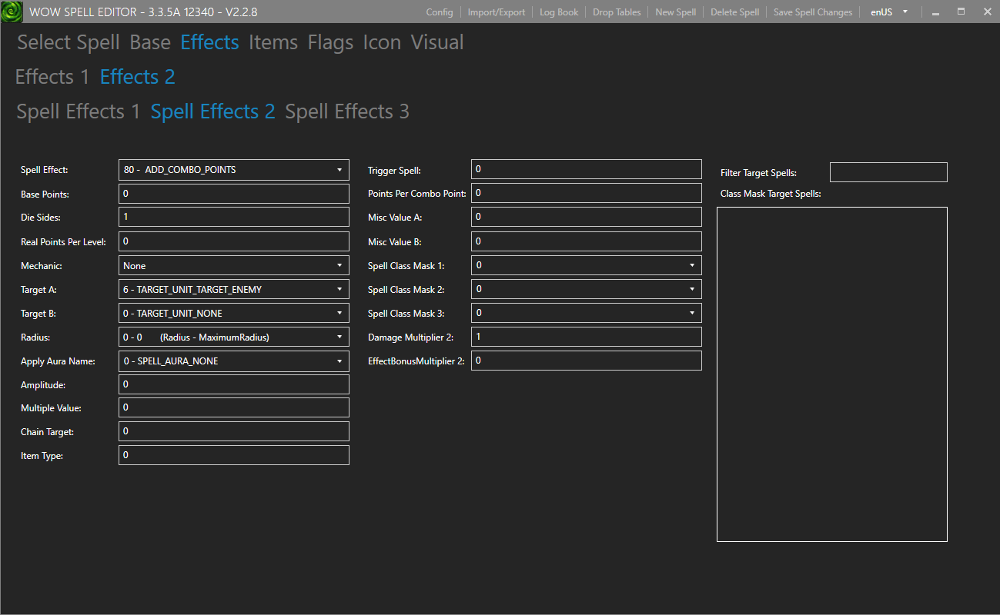
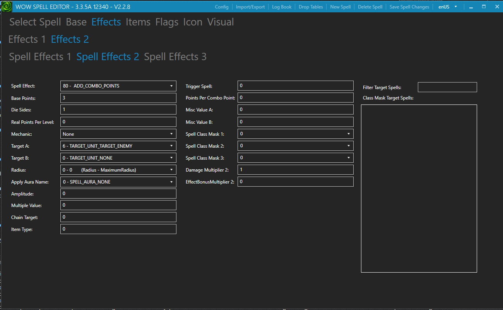

# Change Combo Points Gained in 3 Minutes

This guide walks you through editing a spell to change the combo points gained in 3 minutes using the Spell Editor.

Written tutorial of my video: [Spell Editor - Change Combo Points Gained in 3 Minutes](https://www.youtube.com/watch?v=4ZPX-9L5wug)

<iframe
  width="100%"
  style="aspect-ratio: 16/9"
  src="https://www.youtube.com/embed/4ZPX-9L5wug"
  title="Spell Editor - Change Combo Points Gained in 3 Minutes"
  frameborder="0"
  allow="accelerometer; autoplay; clipboard-write; encrypted-media; gyroscope; picture-in-picture"
  allowfullscreen>
</iframe>

<!-- more -->

---

## Overview

In this guide you will learn how to:

- Locate the correct spell in the Spell Editor
- Find the Combo Points aura effect
- Adjust the combo points value
- Export and apply your changes to the server and client

!!! info "Example used in this guide"
    We will be editing the **Sinister Strike (Rank 1)** spell and setting its combo points to **4**.

---

## Prerequisites

Before you begin, make sure you have:

- [x] Spell Editor installed and working
- [x] Access to your server's `Data` folder
- [x] Access to your client patch folder

---

## Steps

### Step 1 — Find the Spell

Open the Spell Editor and search for the spell you want to modify. In this example, search for **Sinister Strike (Rank 1)**.

Click the spell to open its details.

---

### Step 2 — Navigate to the Effects Tab

With the spell open, click the **Effects** tab, then select the **Effects 2** sub-tab.

---

### Step 3 — Locate the Combo Points Effect

Inside the **Effects 2** tab, look through the **Spell Effect 1**, **Spell Effect 2**, and **Spell Effect 3** sections.
You are looking for an **Spell Effect** field with the value `80 - ADD_COMBO_POINTS`.

!!! tip
    The Combo Points aura is not always in the same Effect slot — check all three until you find it.



In this example it is found under **Spell Effect 2**.

---

### Step 4 — Set the Combo Points

Now adjust the two fields that control combo points:

| Field | Value | Explanation |
|---|---|---|
| **Base Points** | `3` | The base combo points minus 3 |
| **Die Sides** | `1` | Adds the remaining 1 combo point |

!!! note "How the math works"
    The final combo points equals **Base Points + Die Sides**.
    For **4** combo points: set Base Points to `3` and Die Sides to `1`.
    Adjust these values to reach any combo points you want.



---

### Step 5 — Save Your Changes

Press ++ctrl+s++ to save the spell.

---

### Step 6 — Export the Spell Files

1. Click **Import and Export** in the top menu
2. Go to the **Export** tab
3. Choose your preferred export method and export the files


---

### Step 7 — Apply the Files

Move the exported `.dbc` files to the correct locations:

- **Server:** Place the files in your server's `Data` folder
- **Client:** Place the files in your client patch

---

### Step 8 — Test In-Game

Start your server and log into the game. Cast **Sinister Strike (Rank 1)**, or the spell you modified on a target dummy or enemy — you should now gain 4 combo points instead of the original amount.

!!! success "Done!"
    Your spell now gives the desired combo point(s) you want.

---

## Summary

```
Spell Editor → Effects → Effects 2 → Find "ADD_COMBO_POINTS" spell effect
→ Base Points = (target combo points - 3) → Die Sides = 1
→ Save (CTRL+S) → Export → Deploy to server & client
```
