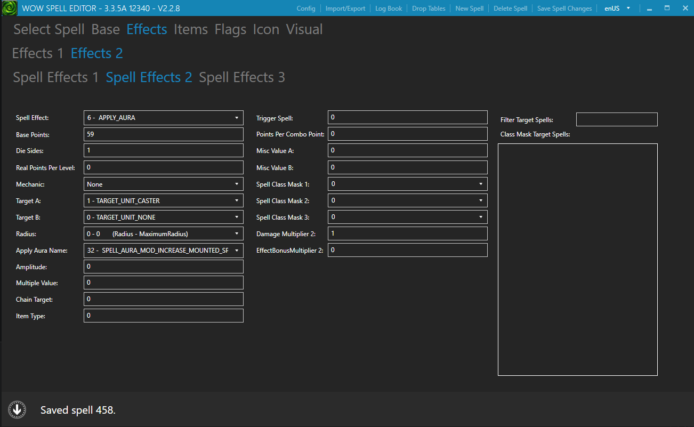
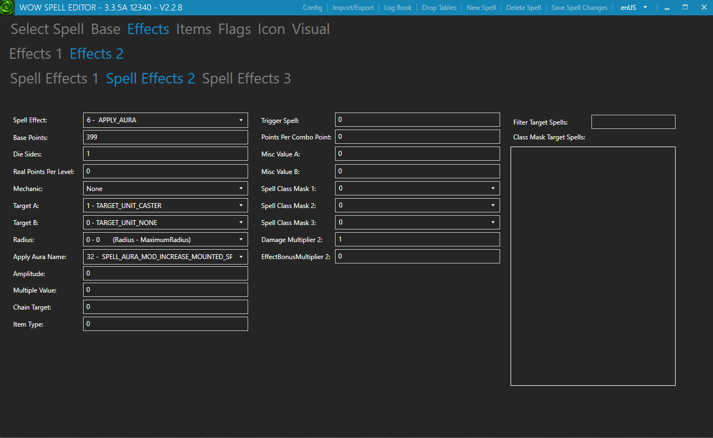
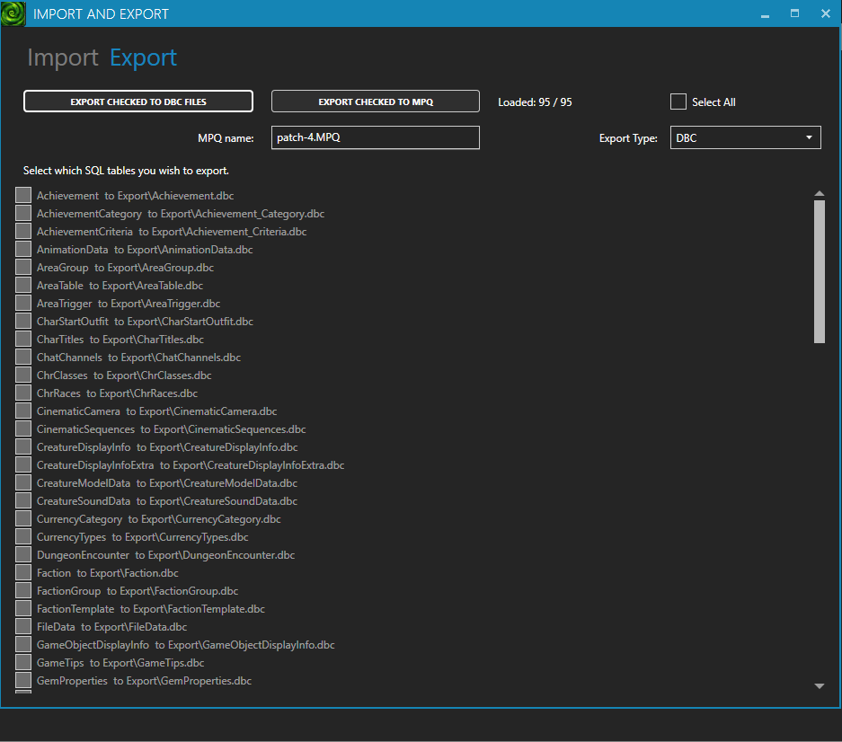

# Change Mount Movement Speed

This guide walks you through editing a mount's movement speed using the Spell Editor.

Written tutorial of my video: [Spell Editor - Change Mount Movement Speed](https://www.youtube.com/watch?v=tV08gsd23jg)

<iframe
  width="100%"
  style="aspect-ratio: 16/9"
  src="https://www.youtube.com/embed/tV08gsd23jg"
  title="Spell Editor - Change Mount Movement Speed"
  frameborder="0"
  allow="accelerometer; autoplay; clipboard-write; encrypted-media; gyroscope; picture-in-picture"
  allowfullscreen>
</iframe>

<!-- more -->

---

## Overview

In this guide you will learn how to:

- Locate the correct spell in the Spell Editor
- Find the Mount Speed aura effect
- Adjust the movement speed value
- Export and apply your changes to the server and client

!!! info "Example used in this guide"
    We will be editing the **Brown Horse** spell and setting its movement speed to **400%**.

---

## Prerequisites

Before you begin, make sure you have:

- [x] Spell Editor installed and working
- [x] Access to your server's `Data` folder
- [x] Access to your client patch folder

---

## Steps

### Step 1 — Find the Spell

Open the Spell Editor and search for the spell you want to modify. In this example, search for **Brown Horse**.

Click the spell to open its details.

---

### Step 2 — Navigate to the Effects Tab

With the spell open, click the **Effects** tab, then select the **Effects 2** sub-tab.

---

### Step 3 — Locate the Mount Speed Effect

Inside the **Effects 2** tab, look through the **Spell Effect 1**, **Spell Effect 2**, and **Spell Effect 3** sections.
You are looking for an **Apply Aura Name** field with the value `Mount Speed`.

!!! tip
    The Mount Speed aura is not always in the same Effect slot — check all three until you find it.



In this example it is found under **Spell Effect 2**.

---

### Step 4 — Set the Movement Speed

Now adjust the two fields that control movement speed:

| Field | Value | Explanation |
|---|---|---|
| **Base Points** | `399` | The base percentage minus 1 |
| **Die Sides** | `1` | Adds the remaining 1% |

!!! note "How the math works"
    The final movement speed equals **Base Points + Die Sides**.
    For **400%** speed: set Base Points to `399` and Die Sides to `1`.
    Adjust these values to reach any speed percentage you want.



---

### Step 5 — Save Your Changes

Press ++ctrl+s++ to save the spell.

---

### Step 6 — Export the Spell Files

1. Click **Import and Export** in the top menu
2. Go to the **Export** tab
3. Choose your preferred export method and export the files



---

### Step 7 — Apply the Files

Move the exported `.dbc` files to the correct locations:

- **Server:** Place the files in your server's `Data` folder
- **Client:** Place the files in your client patch

---

### Step 8 — Test In-Game

Start your server and log into the game. Mount up using the **Brown Horse** — you should now be moving at 400% speed.

!!! success "Done!"
    Your mount movement speed has been successfully updated.

---

## Summary

```
Spell Editor → Effects → Effects 2 → Find "Mount Speed" aura
→ Base Points = (target% - 1) → Die Sides = 1
→ Save (CTRL+S) → Export → Deploy to server & client
```
